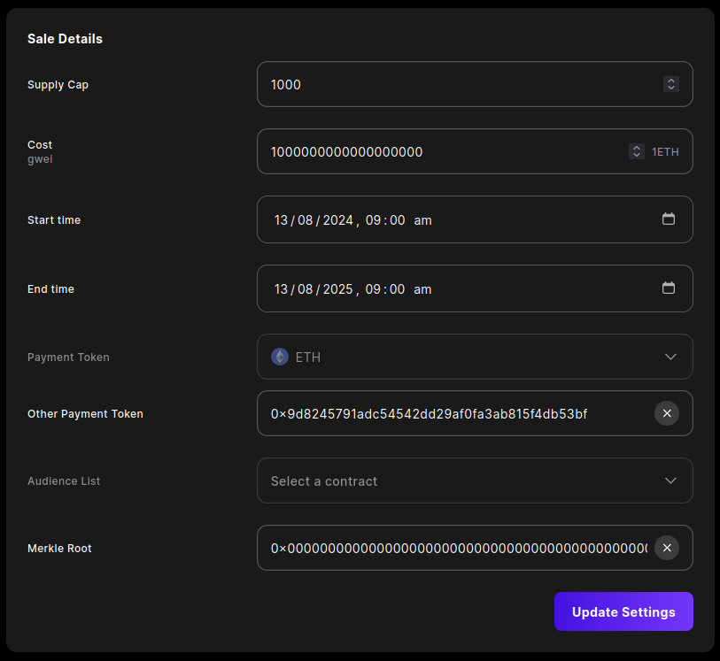

# Currency Abstraction Demo

Demo demonstrating currency abstraction via a sales contract and NFT collection deployed via the [Sequence Builder][0].

## Quick Start

Copy `.env.example` to `.env` and fill with your project information. To test things out, you can use the pre-provided keys in the `.env.example` file:

```
cp .env.example .env
```

Then install and run:

```js
pnpm install && pnpm dev
```

The app will start on `localhost:4444`

To provide your own keys from [Sequence Builder][0], simply edit the `.env` file accordingly.

## Slow Start

These instructions are for those who want to understand the entire end to end process of configuring a project with Sequence Builder, deploying contracts, and having liquidity provided on Uniswap.

> [!NOTE]
> For the purposes of this demo, contracts are deployed on the Sepolia testnet.
> We use Sepolia as it is supported by ZeroX, Uniswap and has a well funded faucet for obtaining testnet ETH.


### Builder Configuration

Navigate to [Sequence Builder][0] and create a new project.
Ensure Sepolia is active for your project.

> [!TIP]
> The Sequence wallet relayer will relay Sepolia transactions for free.
> If you are using another wallet provider you can use a [Sepolia faucet](https://sepolia-faucet.pk910.de) to obtain testnet ETH to pay for gas fees.

#### ERC-20 Currency Token

Navigate to the Contracts tab and deploy a new `Currency Token` contract (under `more contracts`).


Navigate to the contract, select the Write Contract tab, and call the `mint` function to issue yourself some tokens.


> [!TIP]
> Be sure to include decimals when minting tokens. For example, if you want to mint 100 tokens with 18 decimals, you must enter `100000000000000000000`.

#### ERC-1155 Game Items Collection

Navigate to the Contracts tab and deploy a new `Web3 Game Items` contract.


Navigate to the Collections tab and create a new collection.

Add some new items to the collection.


Select `Link Contract` and link the collection to your deployed ERC-1155 contract.

#### ERC-1155 Sale Contract

Navigate back to the Contracts tab and deploy a new `Sale Contract for Web3 Game Item Collection` contract.


Navigate to the previously deployed Items contract, select the Write Contract tab, and call the `grantRole` function to grant the Sale contract the `MINTER_ROLE`.


> [!NOTE]
> The minter role identifier is `0x9f2df0fed2c77648de5860a4cc508cd0818c85b8b8a1ab4ceeef8d981c8956a6`, which is the keccak256 hash of the string `MINTER_ROLE`.

Navigate to the Sale contract, select the Mint Access tab, and set the parameters for the sale. Set the `Other Payment Token` to the address of the previously deployed ERC-20 token.



> [!IMPORTANT]
> If the current time is within the date range provided, this will activate the sale.
> Consider setting the date range to the future or performing this step after completing the rest of the configuration.


### Uniswap Configuration

> [!IMPORTANT]
> At the time of writing, the current Uniswap UI does not support Sepolia.
> We can still access Uniswap via an older version of the UI via IPFS.
> The version we will access is [release web/5.14.2](https://github.com/Uniswap/interface/releases/tag/web%2F5.14.2).

Install IPFS and start the daemon.

```bash
ipfs daemon
```

Navigate to [Uniswap's older interface](http://bafybeidymy5uhlni5456cwgyyj5wlst44gdh5343cfkivvvdysiwok5uam.ipfs.localhost:8080) and connect your wallet.

In the Settings, ensure `Enable testnets` is enabled and `Hide unknown tokens` is disabled so that your token is visible.

Change your network to `Sepolia` and add your token to the interface.

Navigate to the `Pool` tab and add liquidity for your token.


## References

Check out the [Sequence Builder][0] and the [Sequence docs][1] for more information on how to use the platform.

[0]: https://sequence.build
[1]: https://docs.sequence.xyz
